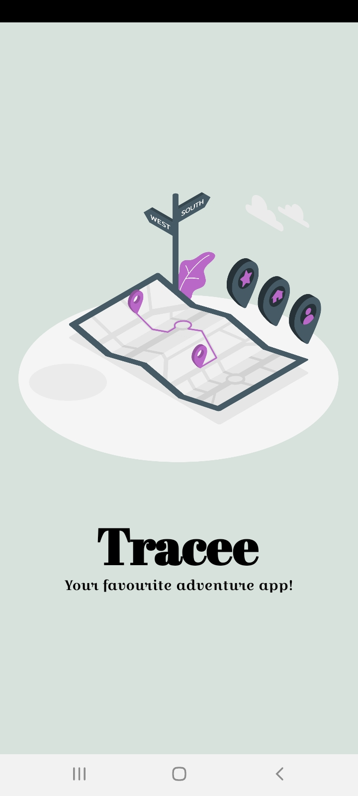
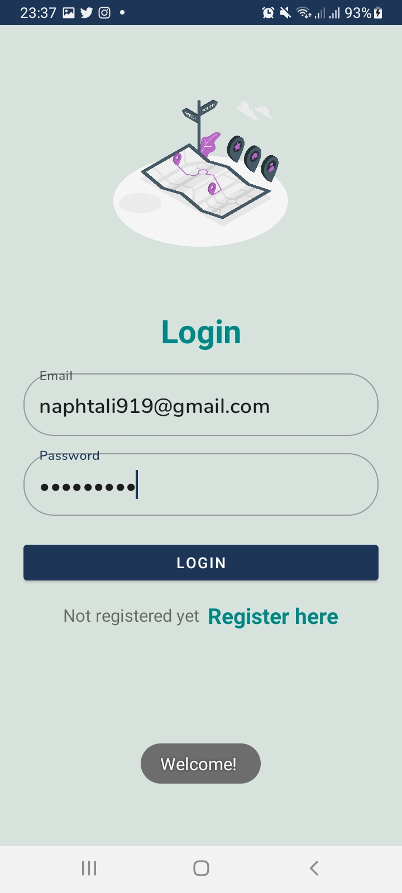
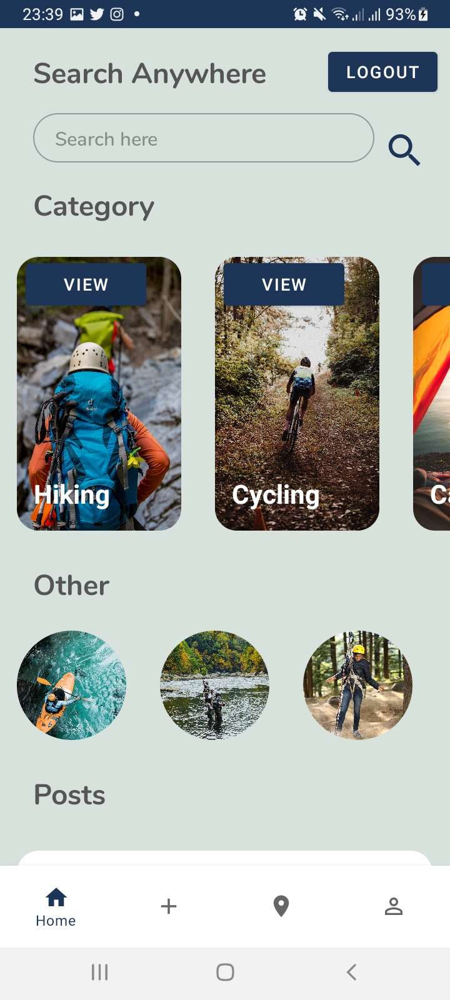
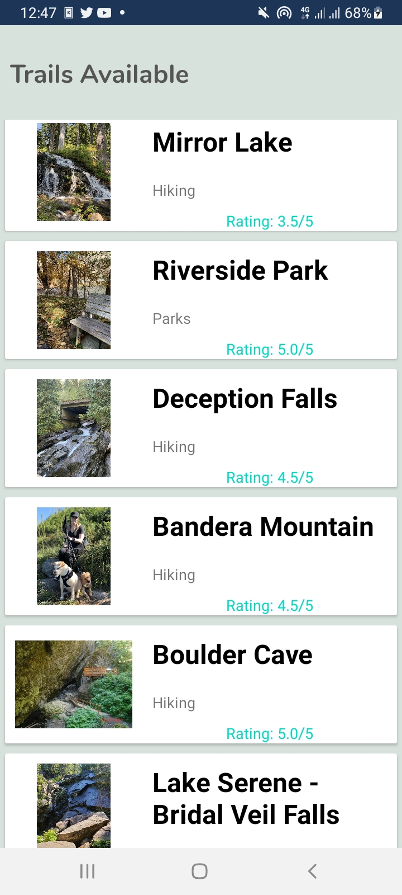
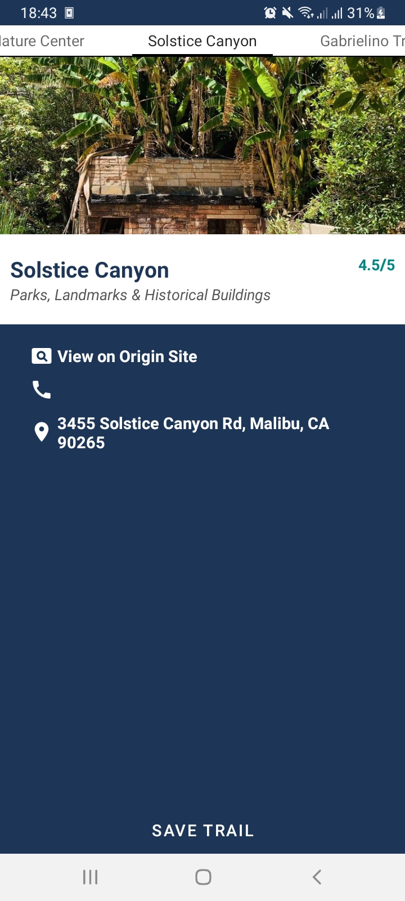

# Tracee App
## Author
Naphtali Makori
## App under construction!!!
## Description

This is an application that allows users to search for places to go have fun, take a walk or anything that satisfies them since it is hard to find places or trails to go to and be satisfied.

## Demo

     

      

     

## Installation Guide
* Ensure Git is installed.
* Clone the repo link or download the ZIP.
* Open terminal clone the project to any directory on the machine.
* Enter android studio and make sure gradle finishes to build.
* Run the application on the emulator/USB.

## Contributors
So far there are no contributors for this project.
If you wish to, contact me :)

## Future Implementation
* Add API on Hiking, Cycling, Travel, Wild Tour and Camping activities.

## Architecture
#### Resource https://developer.android.com/jetpack/guide
### Meaning of Architecture

In information systems, applications architecture or application architecture is one of several architecture domains that form the pillars of an enterprise architecture. An applications architecture describes the behavior of applications used in a business, focused on how they interact with each other and with users.

## Bugs
* API only fetchs data around USA.

## Setup and installation
* Ensure you have Android Studio installed on your pc.
* Head to your terminal.
* Used git clone https://github.com/Naphtali-cpu/Tracee-App.git clone the project.
* After cloning, open the project cloned in Android Studio.
* Make sure gradle finishes to sync.
* Now run the project on emulator and there you have the application!

## Behaviour Driven Development(BDD)
* The sprint of the project will come soon!!
* The android application page loads in form of a splash.
* User is required to login or register an account.
* After user logs in, user inputs location to look for trails.

## Technologies Used
* Java
* Android

## Tools used
* Git

## App Dependencies

    implementation 'androidx.appcompat:appcompat:1.3.1'
    implementation 'com.google.android.material:material:1.4.0'
    implementation 'androidx.constraintlayout:constraintlayout:2.1.0'
    implementation 'androidx.recyclerview:recyclerview:1.2.1'
    implementation 'com.google.firebase:firebase-auth:21.0.1'
    implementation 'androidx.legacy:legacy-support-v4:1.0.0'
    implementation 'com.google.android.gms:play-services-maps:17.0.1'
    testImplementation 'junit:junit:4.+'
    androidTestImplementation 'androidx.test.ext:junit:1.1.3'
    androidTestImplementation 'androidx.test.espresso:espresso-core:3.4.0'
    implementation 'com.jakewharton:butterknife:10.2.0'
    annotationProcessor 'com.jakewharton:butterknife-compiler:10.2.0'
    //noinspection GradleCompatible
    implementation 'com.android.support:cardview-v7:28.0.0'
    implementation 'com.github.rey5137:material:1.2.5'
    androidTestImplementation 'androidx.test.espresso:espresso-core:3.3.0'
    testImplementation 'org.robolectric:robolectric:4.4'
    androidTestImplementation 'androidx.test:runner:1.3.0'
    androidTestImplementation 'androidx.test:rules:1.3.0'
    implementation 'com.google.android.material:material:<version>'
    implementation 'com.jakewharton:butterknife:10.2.0'
    annotationProcessor 'com.jakewharton:butterknife-compiler:10.2.0'
    implementation 'com.squareup.retrofit2:retrofit:2.5.0'
    implementation 'com.squareup.retrofit2:converter-gson:2.5.0'
    implementation group: 'javax.annotation', name: 'javax.annotation-api', version: '1.3.2'
    implementation 'com.squareup.picasso:picasso:2.71828'
    implementation 'org.parceler:parceler-api:1.1.12'
    annotationProcessor 'org.parceler:parceler:1.1.12'
    implementation 'com.google.firebase:firebase-database'
    implementation platform('com.google.firebase:firebase-bom:26.4.0')
    implementation 'com.google.firebase:firebase-database'
    implementation 'com.firebaseui:firebase-ui-database:7.1.1'
    implementation 'com.google.firebase:firebase-analytics'
    implementation 'com.android.support.constraint:constraint-layout:1.1.3'
    testImplementation 'junit:junit:4.12'
    androidTestImplementation 'com.android.support.test:runner:1.0.2'
    androidTestImplementation 'com.android.support.test.espresso:espresso-core:3.0.2'
    implementation 'com.google.firebase:firebase-core:16.0.1'
    implementation 'com.google.firebase:firebase-database:16.0.1'
    implementation 'com.google.firebase:firebase-auth:16.0.1'
    implementation 'com.google.firebase:firebase-storage:16.0.1'
    implementation 'com.google.firebase:firebase-firestore:17.0.1'
    implementation 'de.hdodenhof:circleimageview:2.2.0'
    api 'com.theartofdev.edmodo:android-image-cropper:2.6.+'
    implementation 'com.github.bumptech.glide:glide:4.8.0'
    annotationProcessor 'com.github.bumptech.glide:compiler:4.8.0'
    implementation 'id.zelory:compressor:3.0.1'
    implementation 'com.android.support:multidex:1.0.3'
    api 'com.theartofdev.edmodo:android-image-cropper:2.8.+'

## Contact Information
* Email- naphtali919@gmail.com
* Mobile Number- +254727991993
* Instagram @ _naphtalimakori
* Facebook @ Naphtali McOrri
* Linked In @ Naphtali Makori

## License
Licenced by

MIT License

Copyright (c) [2021] [Naphtali Makori]

Permission is hereby granted, free of charge, to any person obtaining a copy of this software and associated documentation files (the "Software"), to deal in the Software without restriction, including without limitation the rights to use, copy, modify, merge, publish, distribute, sublicense, and/or sell copies of the Software, and to permit persons to whom the Software is furnished to do so, subject to the following conditions:

The above copyright notice and this permission notice shall be included in all copies or substantial portions of the Software.

THE SOFTWARE IS PROVIDED "AS IS", WITHOUT WARRANTY OF ANY KIND, EXPRESS OR IMPLIED, INCLUDING BUT NOT LIMITED TO THE WARRANTIES OF MERCHANTABILITY, FITNESS FOR A PARTICULAR PURPOSE AND NONINFRINGEMENT. IN NO EVENT SHALL THE AUTHORS OR COPYRIGHT HOLDERS BE LIABLE FOR ANY CLAIM, DAMAGES OR OTHER LIABILITY, WHETHER IN AN ACTION OF CONTRACT, TORT OR OTHERWISE, ARISING FROM, OUT OF OR IN CONNECTION WITH THE SOFTWARE OR THE USE OR OTHER DEALINGS IN THE SOFTWARE.

